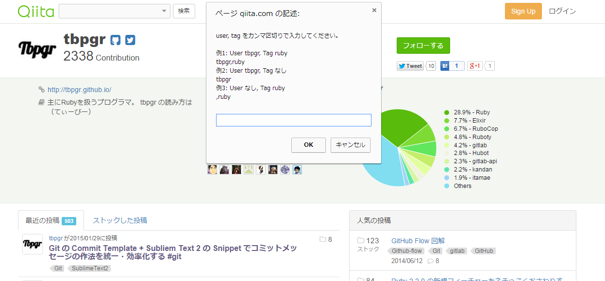
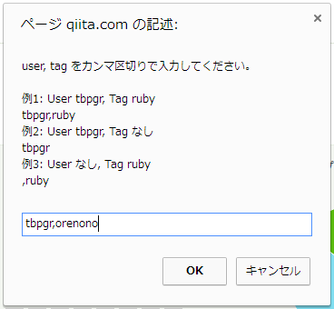
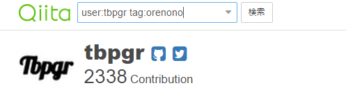
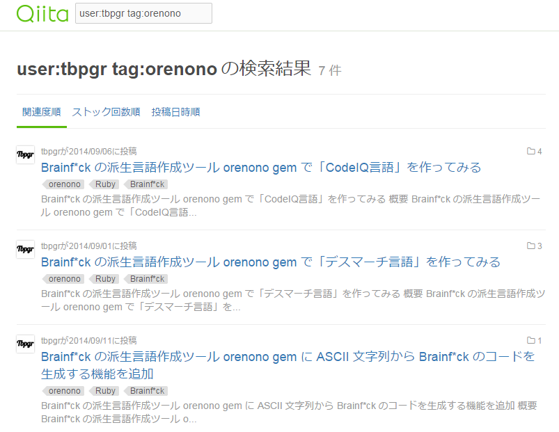
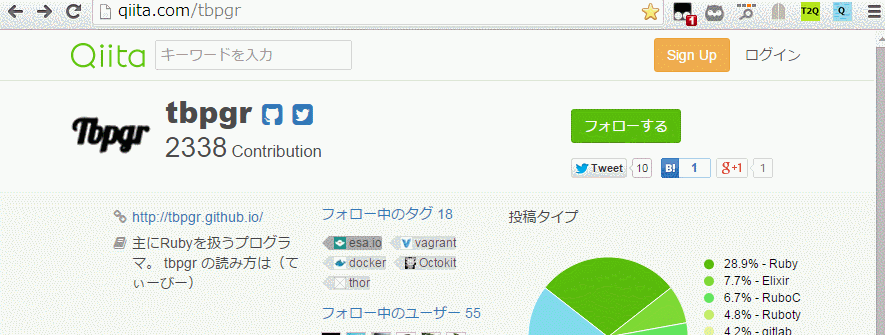

# Chrome extension Soku Qiita
**Soku Qiita** (**即聞いた**) は検索入力欄へのキーアクセスを行う Chrome 拡張です。  
CUI / ショートカットジャンキー 必携のアイテム・・かどうかは分かりませんが、そこそこおすすめです。  

## :musical_score: Images
### :baby_chick: Before

:sun_with_face::sun_with_face::sun_with_face::sun_with_face::new_moon_with_face::new_moon_with_face::new_moon_with_face::first_quarter_moon_with_face::first_quarter_moon_with_face::first_quarter_moon_with_face:  
:turtle::grey_question::grey_question::grey_question::grey_question::grey_question::grey_question::grey_question::grey_question::moneybag:  
:grey_question::turtle::grey_question::grey_question::grey_question::grey_question::grey_question::grey_question::grey_question::moneybag:  
:turtle::grey_question::grey_question::grey_question::grey_question::grey_question::grey_question::grey_question::grey_question::moneybag:  

### :chicken: After
:sun_with_face::sun_with_face::sun_with_face::sun_with_face::sun_with_face::sun_with_face::sun_with_face::sun_with_face::sun_with_face::sun_with_face:  
:grey_question::grey_question::grey_question::grey_question::grey_question::grey_question::grey_question::rabbit::grey_question::moneybag:  
:grey_question::grey_question::grey_question::grey_question::grey_question::grey_question::rabbit::grey_question::grey_question::moneybag:  
:grey_question::grey_question::grey_question::grey_question::grey_question::rabbit::grey_question::grey_question::grey_question::moneybag:  

## :cloud: Chrome Web Store
:link: [chrome-soku_qiita](https://chrome.google.com/webstore/detail/sokuqiita/pdbkaalghgacoghbclifkbklgeoaneil)

## :computer: 目的
特定のユーザー名、タグ目の検索を 1 入力でも少なく、キーボードから手を離さずに実現したい。

## :clock1: 経緯
Qiita の検索メニューはどんどんリッチになるものの、  
CUI のショートカットサポートがないのでマウス操作が必要です。  
例えば、今の検索機能だと  

* マウスで検索欄に移動し、フォーカスをあてる
* ▼が表示される
* ▼をクリックする
* マウスでユーザー指定欄 or タグ指定欄にフォーカスを当てる
* 検索ワードを入力する
* Enter キー

というアクションが必要です。

soku_qiita の機能を利用すれば

* 任意のキー(ショートカット割り当て)
* 検索ワードを入力
* Enter(検索欄に反映)
* Enter(検索の実行)

で実行可能になります。快適。

## :scroll: 機能
### 基本機能
* メニューにある soku_qiita ボタンを押すか、割り当てたショートカットを入力
* 入力ダイアログが表示される
* カンマ区切りで user, tag を入力
    * `tbpgr,ruby` なら "user:tbpgr tag:ruby"
    * `tbpgr` なら "user:tbpgr"
    * `,ruby` なら "tag:ruby"
* OK をクリック
* キーワード入力欄に検索ワードが設定される
* 検索ボタンをクリック
    * 追加のワードを設定することを考慮し、あえて検索ボタンクリックまで自動化していない

## :computer: 試用
### :dog: メニューバーを確認

### :cat: Qiita にて chrome-soku_qiita を呼び出し

### :rabbit: ダイアログボックスに検索値を入力

### :frog: 入力欄に反映

### :koala: 検索の実行

## :computer: Demo

